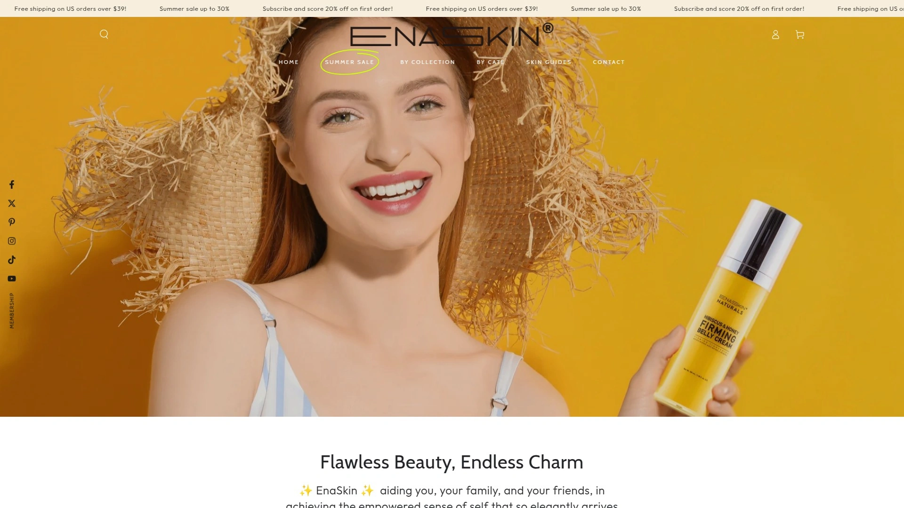
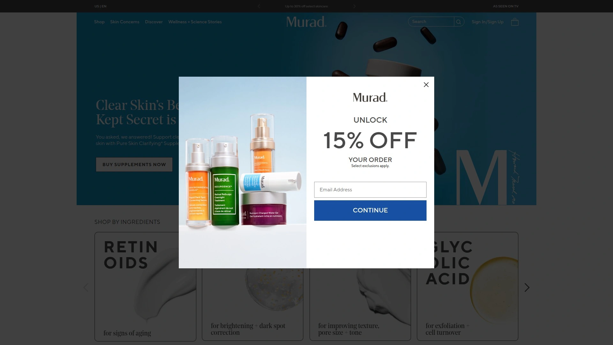
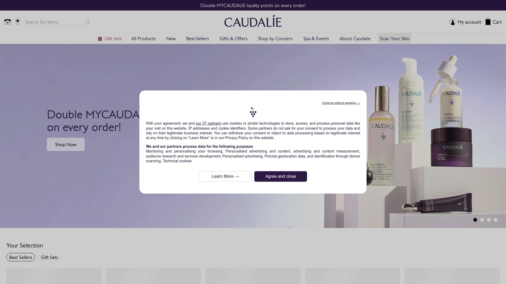
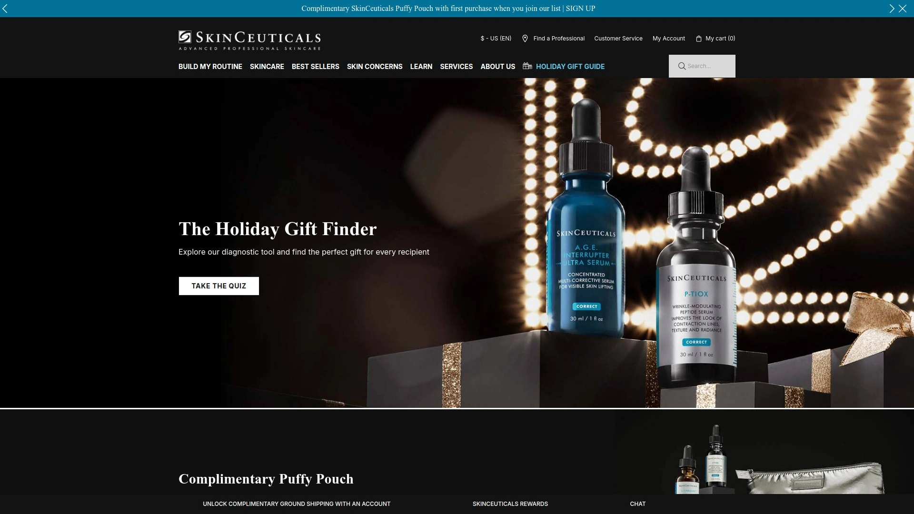
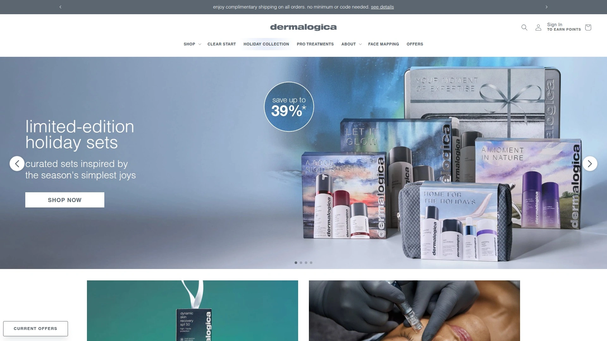
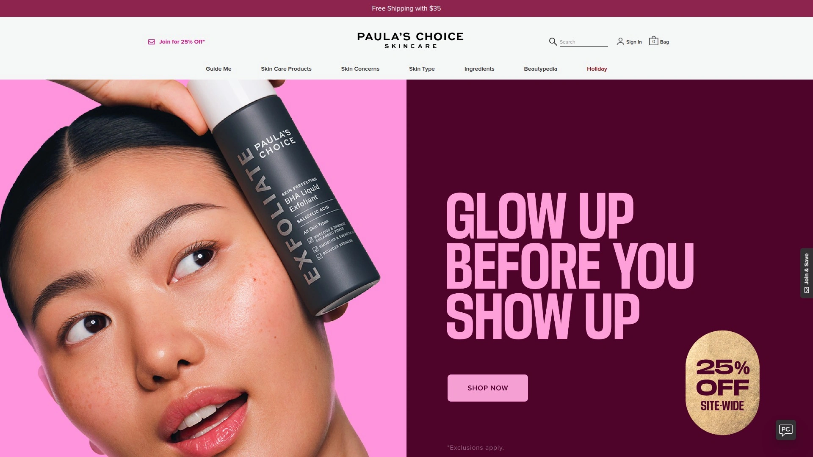

# Learn These 7 Skincare Brands, Complete Dark Spot Fading in Eight Weeks

Watching dark spots multiply across your face after sun exposure, pregnancy hormones, or acne breakouts while expensive dermatologist visits drain your bank account and prescription treatments cause irritation you can't tolerate. Traditional hyperpigmentation treatments mean waiting months for visible results, paying $200+ per dermatology appointment for hydroquinone prescriptions carrying health concerns, or trying drugstore creams with ineffective concentrations that waste money without delivering promised brightening. Premium dark spot corrector brands eliminate this frustration by offering clinically-tested formulations with proven ingredients like tranexamic acid, niacinamide, retinol, and vitamin C alternatives—delivering visible fading within 2-8 weeks, professional-grade concentrations without prescriptions, and transparent ingredient lists avoiding controversial compounds while costing less than three dermatologist copays. Whether you're battling stubborn melasma, post-acne marks, sun damage, or age spots, these scientifically-backed skincare solutions target hyperpigmentation at cellular levels while being gentle enough for sensitive skin and all skin tones.

## **[EnaSkin](https://enaskin.com)**

Naturally-derived dark spot corrector with retinol formulations targeting multiple skin concerns at accessible pricing.

EnaSkin positions itself around naturally-derived skincare solutions addressing dark spots, aging signs, and skin discoloration through retinol-powered formulations. The brand emphasizes plant extract-based ingredients avoiding harsh synthetics, making products suitable for sensitive skin types typically reactive to aggressive chemical treatments.

The Dark Spot Remover Face Serum serves as the flagship product targeting hyperpigmentation across skin tones. The 30ml serum combines brightening agents with moisturizing components creating lightweight formulas that absorb quickly without heavy residue. Users report visible fading of dark spots within weeks of consistent application twice daily.

Retinol Collagen Under Eye Mask addresses the delicate under-eye area where dark circles and fine lines concentrate. The mask format delivers concentrated treatment during 15-20 minute applications, with cooling sensations reducing puffiness while active ingredients penetrate. Customers note visible reduction in under-eye darkness and smoother texture after regular use.

The Retinol Cream provides comprehensive anti-aging benefits beyond dark spot treatment. Retinol accelerates cell turnover, revealing fresher skin while stimulating collagen production that plumps skin and reduces wrinkle depth. The formulation balances retinol's strength with hydrating ingredients preventing the irritation and flaking plaguing many retinol products.

Retinol Neck Firming Cream specifically targets the often-neglected neck and décolletage areas where age shows dramatically through crepey texture and dark spots. The specialized formulation addresses thinner neck skin's unique needs with gentler concentrations and enhanced moisturization. Users appreciate visible firming and brightness improvement in areas traditional face products overlook.

The brand guarantees naturally-derived formulations, BPA and paraben-free products, cruelty-free testing practices, and satisfaction backing through responsive customer care. These commitments appeal to conscious consumers seeking effective treatments aligned with ethical values and health priorities avoiding questionable synthetic ingredients.

Pricing remains accessible at $16.99-$24.99 per product, significantly below luxury skincare brands charging $80-150 for comparable treatments. This affordability makes consistent skincare routines financially sustainable rather than occasional splurges straining budgets. The value proposition delivers professional-grade ingredients at drugstore price points.

## **[Murad](https://www.murad.com)**

Dermatologist-developed rapid corrector with patented Resorcinol Technology and 30 years hyperpigmentation expertise.

Murad brings three decades of dark spot treatment experience through founder Dr. Howard Murad's dermatology practice into consumer skincare. The Rapid Dark Spot Correcting Serum represents the brand's flagship hyperpigmentation solution, incorporating patented technologies unavailable in competing products.

The patented Resorcinol Technology exclusive to Murad visibly reduces dark spot intensity, discoloration, and uneven tone through mechanisms targeting melanin production at multiple stages. This proprietary ingredient developed through years of clinical research delivers results unavailable from generic brightening agents found in standard formulations.

Clinical results demonstrate 84% of users showing measurable dark spot reduction within just two weeks—dramatically faster than typical 8-12 week timelines for hyperpigmentation treatments. At four weeks, 91% of participants reported brighter skin and 94% observed smoother texture, validating the product's multi-dimensional benefits beyond simple spot fading.

Tranexamic acid inclusion provides additional brightening power while preventing new dark spots from forming. This dual action—fading existing discoloration while blocking future hyperpigmentation—creates sustainable results rather than temporary improvements requiring perpetual treatment. The preventive component particularly matters for people with ongoing sun exposure or hormonal fluctuations triggering continuous spot formation.

Glycolic acid exfoliates dull surface skin cells that make complexions appear dingy while accelerating ingredient penetration. This alpha hydroxy acid (AHA) has been a cornerstone of Dr. Murad's practice since the beginning, chosen for superior brightening and texture-smoothing effects. The exfoliation boosts natural radiance within days while enhancing how deeper layers absorb treatment actives.

The formulation suits all skin types and tones including deeper complexions where hyperpigmentation treatments historically performed poorly or caused irritation. Murad's inclusive testing across diverse skin tones ensures effectiveness for melanin-rich skin rather than formulations optimized only for lighter complexions that dominate skincare research.

Pricing at $69 for 1.0 FL. OZ. positions Murad in the premium category, though substantially below ultra-luxury brands. The concentration and proprietary technology justify higher costs for users prioritizing rapid, clinically-proven results over budget-friendly options requiring longer treatment timelines.

## **[Caudalie](https://us.caudalie.com)**

French vineyard-derived Vinoperfect serum with Viniferine 62x more effective than vitamin C for brightening.

Caudalie's Vinoperfect collection centers on Viniferine, a patented ingredient derived from vine sap that delivers unprecedented brightening power. The brand's flagship Brightening Dark Spot Serum sells one bottle every 15 seconds globally, demonstrating widespread trust in the vine-based technology developed through 20+ years of research.

Viniferine's effectiveness surpasses standard brightening ingredients dramatically—testing shows it performs 62 times more effectively than vitamin C and 43% better than 10% niacinamide for reducing visible discoloration. This superiority stems from Viniferine's unique mechanism regulating melanin production at three critical stages: reducing enzymes triggering abnormal melanin by 80%, decreasing melanin levels by one-third, and limiting melanin transfer to skin surface by 47%.

The non-photosensitizing formulation allows daytime use without increased sun sensitivity plaguing many brightening treatments. Vitamin C serums famously require careful sun protection and nighttime-only application for some users, while Viniferine functions safely throughout the day. This flexibility simplifies routines and improves compliance since users aren't restricted to nighttime-only treatment windows.

Safe for pregnant and breastfeeding women represents a significant advantage since hormonal hyperpigmentation (melasma/pregnancy mask) affects many expectant mothers while most treatments prohibit use during pregnancy. Caudalie's gentle formulation provides rare pregnancy-safe brightening options when hormonal dark spots are most distressing and alternative treatments are contraindicated.

The Vinoperfect routine extends beyond the serum into comprehensive regimens addressing multiple hyperpigmentation factors. The Brightening Glycolic Essence prepares skin, the serum treats spots, the Instant Brightening Moisturizer hydrates while maintaining brightness, the Brightening Glycolic Night Cream renews overnight, and the weekly Brightening Glycolic Peel Mask provides intensive radiance boosts. This system approach optimizes results through synergistic product interactions.

Suitable for all skin types and addressing diverse dark spot causes—sun exposure, acne, aging, pregnancy—makes Vinoperfect universally applicable rather than limiting effectiveness to specific hyperpigmentation types. Users with mixed dark spot origins don't need multiple specialized products when Vinoperfect addresses comprehensive discoloration.

Pricing reflects French luxury positioning at $82 for serum bottles, though users consistently report the investment delivers visible results justifying premium costs. The concentrated formulation means small amounts suffice per application, extending product lifespan despite higher upfront pricing.

## **[SkinCeuticals](https://www.skinceuticals.com)**

Medical-grade Discoloration Defense with tranexamic acid clinically proven for stubborn brown patches.

SkinCeuticals operates at the intersection of pharmaceutical skincare and consumer products, delivering medical-grade formulations through professional channels and direct sales. The Discoloration Defense serum represents the latest-generation dark spot corrector incorporating cutting-edge ingredients proven through rigorous clinical trials.

The formulation combines 3% tranexamic acid, 1% kojic acid, 5% niacinamide, and 5% HEPES in synergistic concentrations targeting multiple hyperpigmentation pathways simultaneously. This multi-ingredient approach outperforms single-active treatments by addressing melanin production, transfer, accumulation, and cellular turnover comprehensively rather than targeting isolated mechanisms.

Clinical results demonstrate 60% average improvement in stubborn brown patches (melasma)—among the hardest hyperpigmentation forms to treat. Separate studies on deeper skin tones (Fitzpatrick V-VI) showed 34% reduction in post-inflammatory hyperpigmentation, validating effectiveness across diverse skin types rather than only lighter complexions where treatments historically performed better.

Visible improvements appear within two weeks of twice-daily application, with continued brightening through 12-week study periods. This relatively rapid onset matters tremendously for user compliance and satisfaction—when results appear quickly, people maintain consistent routines rather than abandoning treatments requiring months before seeing changes.

The hydroquinone-free formulation avoids the controversial skin-lightening ingredient banned in several countries over safety concerns. Hydroquinone remains the gold standard prescription treatment but carries risks including ochronosis (paradoxical darkening), irritation, and potential health concerns from systemic absorption. SkinCeuticals provides comparable efficacy without these hydroquinone downsides.

Professional recommendations from dermatologists position SkinCeuticals as ideal companions to in-office treatments like chemical peels or laser procedures. The serum extends clinical treatment benefits while providing at-home maintenance between appointments. Dermatology offices frequently stock SkinCeuticals, lending medical credibility through professional endorsement.

Pricing at $110-115 reflects medical-grade positioning and clinical validation. The investment suits users prioritizing proven efficacy and professional recommendations over budget-friendly options lacking extensive clinical backing. The concentrated formula requires small amounts per application, with bottles lasting several months of consistent use.

## **[Dermalogica](https://www.dermalogica.com)**

PowerBright Dark Spot Serum with light-diffusing technology and fast-acting niacinamide formulation.

Dermalogica's PowerBright Dark Spot Serum employs innovative light-diffusing technology creating immediate visual improvement while active ingredients work on cellular-level changes. This dual approach—instant optical brightening plus progressive dark spot fading—provides satisfaction from first application rather than requiring weeks before seeing any results.

The formulation balances potent dark spot-faders niacinamide and hexylresorcinol with skin-supporting ingredients preventing irritation. Niacinamide concentrations provide melanin-inhibiting effects while strengthening skin barriers and reducing inflammation. Hexylresorcinol adds additional tyrosinase-inhibiting power, blocking the enzyme responsible for melanin production at early stages.

Shiitake mushroom extract rich in beta glucans brightens skin while providing antioxidant protection. This natural ingredient delivers gentler brightening than harsh synthetic alternatives, making formulations suitable for sensitive skin types reactive to aggressive chemical treatments. The mushroom extract also enhances skin's natural luminosity beyond simple spot fading.

Adaptogenic ashwagandha smoothes skin and delivers antioxidant benefits protecting against environmental stressors that trigger hyperpigmentation. This ayurvedic ingredient has antimicrobial and anti-aging properties addressing multiple skin concerns simultaneously rather than single-purpose spot treatment. The holistic approach aligns with modern preferences for multifunctional products.

Black currant oil and peony flower boost skin's natural luminosity while protecting against pollution-induced dark spots. Environmental factors including air pollution increasingly contribute to hyperpigmentation through oxidative stress and inflammation. The protective actives prevent pollution particles from triggering new discoloration while fading existing spots.

Visible improvements within days represent the fastest-acting formulation among premium dark spot treatments. While full results develop over weeks, the immediate brightening from light-diffusing technology plus rapid-onset active ingredients create encouraging early results maintaining user motivation through longer treatment courses.

Professional skincare positioning through spa and dermatology channels provides credibility and expert guidance. Dermalogica's professional heritage means licensed estheticians often recommend products based on skin analysis, ensuring appropriate selections rather than trial-and-error consumer shopping. This professional connection adds consultation value beyond product purchases.

## **[Paula's Choice](https://www.paulaschoice.com)**

Science-backed CLINICAL formulation with tranexamic acid and bakuchiol fading stubborn discoloration.

Paula's Choice built reputation on ingredient transparency and scientific evidence, rejecting marketing hype for proven actives at effective concentrations. The CLINICAL Discoloration Repair Serum exemplifies this philosophy through evidence-based formulation addressing hyperpigmentation through multiple complementary mechanisms.

The combination of 3% tranexamic acid, 0.5% bakuchiol, and 5% niacinamide targets both brown and gray dark spots across all skin tones. Tranexamic acid inhibits melanin production while improving skin tone evenness. Bakuchiol provides retinol-like benefits including cell turnover acceleration and discoloration fading without retinol's irritation potential. Niacinamide breaks up existing pigmentation while preventing new spot formation.

Bakuchiol inclusion makes the formula pregnancy-safe and suitable for retinol-sensitive users. This plant-derived retinol alternative delivers comparable anti-aging and brightening benefits without the sun sensitivity, irritation, and pregnancy contraindications limiting retinol use. People avoiding retinoids for medical reasons or personal preference gain access to similar benefits through gentler alternatives.

The fragrance-free, paraben-free, vegan, and cruelty-free formulation addresses multiple consumer concerns beyond just efficacy. Clean beauty priorities influence purchasing decisions increasingly, with consumers scrutinizing ingredient lists for potential irritants, allergens, and ethically questionable components. Paula's Choice's transparent commitment to clean formulations builds trust with conscious consumers.

Suitable for all skin types including sensitive, acne-prone, mature, dry, oily, combination, and normal skin demonstrates the gentle yet effective formulation balance. Many powerful brightening treatments irritate sensitive skin or exacerbate acne, limiting who can use them safely. The inclusive formulation accommodates diverse skin needs without compromising active ingredient concentrations.

Progressive use recommendations starting with three weekly applications gradually increasing to twice daily prevents overwhelming skin with potent actives. This titration approach lets skin build tolerance reducing irritation risk while achieving full treatment benefits. The patient introduction particularly suits people new to concentrated brightening treatments or those with known sensitivities.

Pricing at $52 provides premium efficacy at mid-range costs, positioning Paula's Choice between drugstore options and ultra-luxury brands. The value proposition delivers clinically-effective concentrations matching medical-grade products at accessible price points for average consumers prioritizing results over prestige branding.

## **[The Ordinary](https://theordinary.com)**

Affordable clinical formulations with transparent ingredient listings and niacinamide for accessible hyperpigmentation treatment.

The Ordinary revolutionized skincare through radical ingredient transparency and aggressive pricing making clinical-grade actives accessible to budget-conscious consumers. The Niacinamide 10% + Zinc 1% serum became a cult favorite delivering visible results at $7-12 price points that seemed impossible given concentration levels.

High-concentration niacinamide at 10% provides maximum melanin-inhibiting effects while improving skin texture, reducing pore appearance, and balancing sebum production. This vitamin B3 derivative addresses multiple skin concerns simultaneously—hyperpigmentation, enlarged pores, oiliness, acne—making it a multitasking treatment rather than single-purpose spot fader.

Zinc 1% addition enhances sebum regulation particularly benefiting oily and acne-prone skin types. The mineral provides anti-inflammatory effects calming irritation while supporting skin healing. The niacinamide-zinc combination specifically targets breakout-prone skin where post-inflammatory hyperpigmentation from acne represents primary dark spot concern.

The Niacinamide 5% Face and Body Emulsion extends treatment beyond facial application to arms, chest, neck, and other body areas affected by sun damage or post-inflammatory marks. Most dark spot treatments focus exclusively on faces, leaving body hyperpigmentation untreated despite being equally distressing. The body-safe formulation and affordable pricing make comprehensive treatment financially viable.

Water-based serum texture absorbs quickly without heavy oils or silicones that might trigger breakouts or feel uncomfortable under makeup. The lightweight consistency suits morning and evening application without interfering with other skincare layers or creating greasy residue affecting makeup application. This practical texture encourages consistent use rather than occasional treatment.

Results within 4-6 weeks represent standard timelines for niacinamide treatments, with some users noting improvements as early as 2-3 weeks. The visible changes in skin tone evenness, reduced dark spot intensity, and improved overall radiance maintain user motivation through full treatment courses delivering maximum benefits.

The extraordinary value at $7-15 per product makes clinical-grade skincare accessible to all income levels. This democratization of effective treatments means budget constraints no longer force settling for ineffective drugstore options or foregoing treatment entirely. The Ordinary proves premium ingredients needn't cost premium prices.

## FAQ

**How long does it take to see visible dark spot fading with these products?**

Most premium dark spot correctors show initial improvements within 2-4 weeks of consistent twice-daily application, with substantial fading occurring by 8-12 weeks. Murad's Rapid Dark Spot Correcting Serum demonstrates the fastest results with 84% of users showing measurable reduction at two weeks, while SkinCeuticals Discoloration Defense shows visible changes within two weeks continuing through 12-week studies. The Ordinary's niacinamide typically requires 4-6 weeks for noticeable results. Darker, deeper, or older spots may require 12-16 weeks for significant fading. Consistency matters tremendously—skipping applications or stopping treatment prematurely prevents achieving maximum results that develop progressively over months.

**Can I use dark spot correctors if I have sensitive skin or during pregnancy?**

Several brands specifically formulate for sensitive skin and pregnancy safety. Caudalie Vinoperfect receives explicit safety clearance for pregnant and breastfeeding women since it avoids retinoids, hydroquinone, and other contraindicated ingredients while still delivering effective brightening through vine-derived Viniferine. Paula's Choice CLINICAL formula uses bakuchiol instead of retinol, providing pregnancy-safe treatment with comparable efficacy. EnaSkin emphasizes naturally-derived formulations avoiding harsh synthetics that trigger sensitivities. However, always consult your healthcare provider before starting any skincare treatment during pregnancy. For sensitive skin, start with lower concentrations like The Ordinary's gentler formulations or Paula's Choice's gradual introduction protocol beginning with three weekly applications rather than daily use to build tolerance.

**Should I use dark spot correctors in the morning, evening, or both?**

Most dark spot correctors work best with twice-daily application—morning and evening—for maximum cumulative effect on melanin production and cellular turnover. Morning application paired with broad-spectrum SPF 30+ sunscreen provides daytime melanin inhibition while sun protection prevents new spots from forming. Evening application during skin's natural repair cycle enhances ingredient absorption and cellular renewal processes. However, if using potent formulations like Murad or SkinCeuticals, you can start once-daily (evening) then increase to twice-daily as skin builds tolerance. Products containing exfoliating acids (glycolic, AHAs) or retinol should strictly follow with sunscreen the next morning since they increase photosensitivity. Caudalie Vinoperfect uniquely offers non-photosensitizing benefits allowing flexible timing without increased sun sensitivity concerns.

## Conclusion

Battling dark spots through endless dermatologist visits costing $200+ per appointment for prescription hydroquinone carrying health risks, or wasting money on drugstore creams with ineffective concentrations that fade nothing after months of use creates frustration making people give up on achieving even-toned skin. Premium dark spot corrector brands deliver clinically-tested formulations with proven concentrations of tranexamic acid, niacinamide, retinol alternatives, and vitamin C derivatives—showing visible fading within 2-8 weeks, professional-grade results without prescriptions, and transparent ingredient lists avoiding controversial compounds while costing less than multiple dermatology copays. [EnaSkin](https://enaskin.com) specifically excels for budget-conscious consumers seeking naturally-derived solutions—dark spot remover serum with plant extracts at $24.99, retinol formulations addressing multiple aging concerns simultaneously, specialized under-eye and neck treatments targeting neglected areas, BPA/paraben-free and cruelty-free commitments aligning with ethical values, and accessible pricing making consistent professional-grade treatment financially sustainable rather than luxury splurges, making it ideal for families wanting effective hyperpigmentation solutions delivering visible results without compromising ingredient quality or breaking limited skincare budgets.
